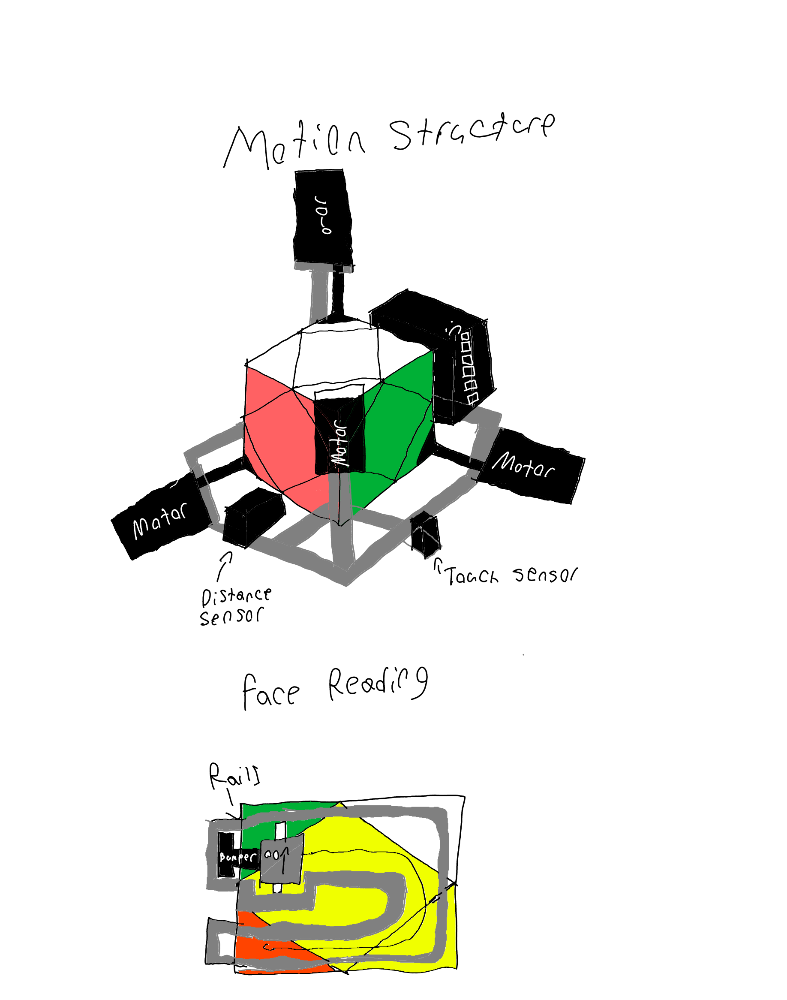
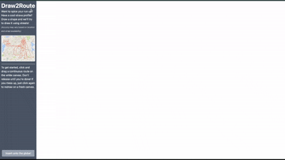
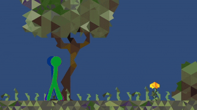

# 👋 Hi there! I'm Andrii Bessarab

I'm a first-year **Mechatronics Engineering** student at the **University of Waterloo** (Class of 2030) who is interested in software development, robotics, and system design.

- 🚀 Actively seeking **Co-op opportunities** for Winter 2026!
- 💡 Just competed at **RythmHacks**—securing a win for _Best Use of Algorithm_ with [Draw2Route](https://devpost.com/software/draw2route)!
- 💻 Currently diving into **SOLIDWORKS & Additive Manufacturing** to expand my knowledge.

---

## 🚀 Projects

Here are a few projects of mine. Check out the [protfolio](https://andriibessarab.com/projects) for more!

| Preview                                                                                                                                    | Project                          | Description                                                                                                                                                | Tech Stack                                      | Links                                                                                          |
|:-------------------------------------------------------------------------------------------------------------------------------------------|:---------------------------------|:-----------------------------------------------------------------------------------------------------------------------------------------------------------|:------------------------------------------------|:-----------------------------------------------------------------------------------------------|
|                | **Custom Robotics Controller**   | Designed, soldered, and programmed a custom C++ controller ("Operator Board") with 30+ inputs for competition robotics.                                    | C++, Embedded Systems, Soldering, Arduino       | [View Code](https://github.com/andriibessarab/frc-team-4951-reefscape-operator-board-firmware) |
|                            | **Skewbot** _(in the making...)_ | Semi-autonomous robot that scans a Skewb, finds the optimal solution using a BFS-derived database, and executes rotations with closed-loop motor control.  | C++, Embedded Systems, BFS Algorithms, Robotics | [View Code](https://github.com/andriibessarab/skewbot)                                         |
|                     | **Draw2Route**                   | Hackathon project that converts a user-drawn line of GPS points into a realistic walking route using OpenStreetMap and optimized shortest-path algorithms. | Python, OSMnx, Graph Theory, APIs, GPS          | [View Code](https://github.com/Jack-Brown12/draw2route)                                        |
|  | **Walking Stickman AI**          | Trained an AI stickman to walk using a custom neural network and genetic algorithm in a Unity simulation.                                                  | C#, Unity, Machine Learning, Neural Networks    | [View Code](https://github.com/andriibessarab/walking-stickman-AI)                             |
---

## 🛠️ Toolkit

A quick glance at the technologies I used in my projects:

| Category            | Skills                                                                                                                                                                                                                                                                                                                                                                                                                                                                                                                                                                                                                                                                                                                                                            |
|:--------------------|:------------------------------------------------------------------------------------------------------------------------------------------------------------------------------------------------------------------------------------------------------------------------------------------------------------------------------------------------------------------------------------------------------------------------------------------------------------------------------------------------------------------------------------------------------------------------------------------------------------------------------------------------------------------------------------------------------------------------------------------------------------------|
| **Languages**       |                                                                                                                 |
| **Frameworks/Libs** |        |
| **Hardware/Tools**  |                                                                                                                                                                                                                      |
| **Concepts**        | Algorithms, OOP, Software Architecture, CI/CD, Computer Vision                                                                                                                                                                                                                                                                                                                                                                                                                                                                                                                                                                                                                                                                                                    |
    
---

## 🔗 Connect

<table>
  <tr>
    <td width="50%">
      <h3> Social </h3>
      

        
      

      

        
      

      

        
      

    </td>
    <td width="50%">
      <h3> Official </h3>
      

        
      

      

        
      

      

        
      

    </td>
  </tr>
</table>

---

## 📊 Stats

  

---

